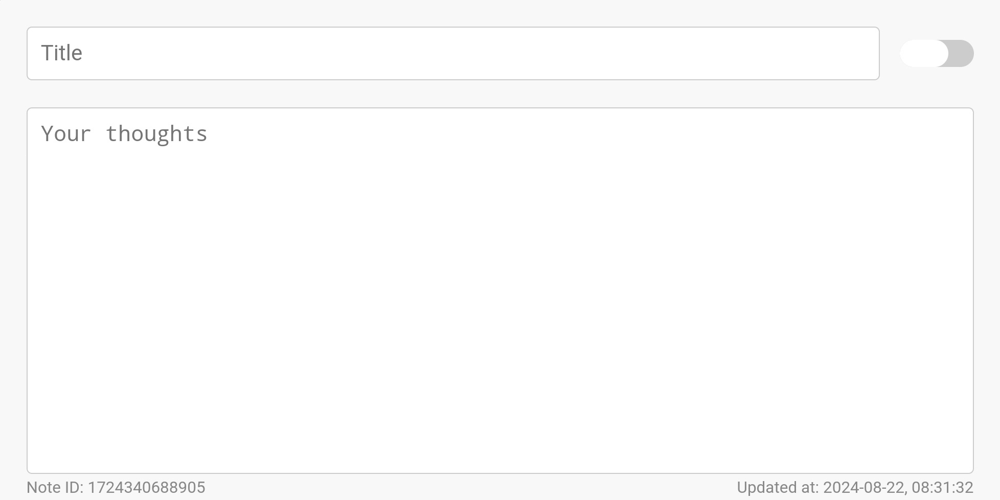
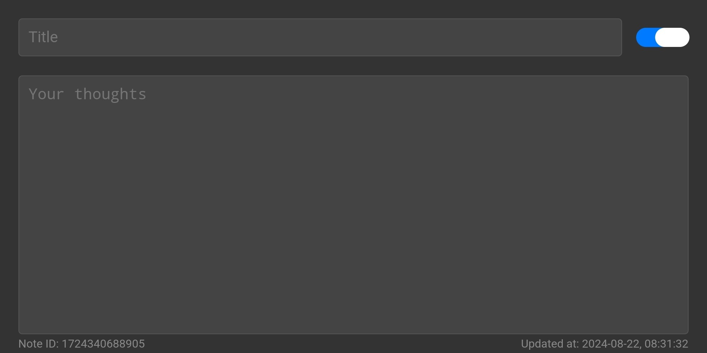
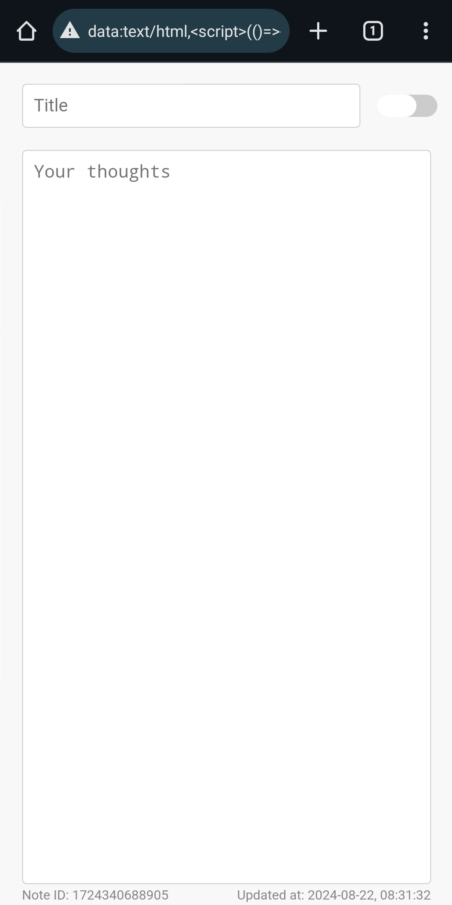
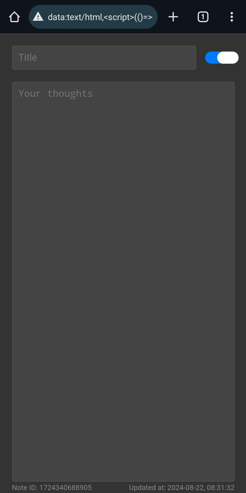
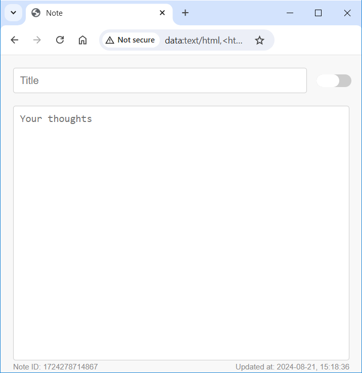
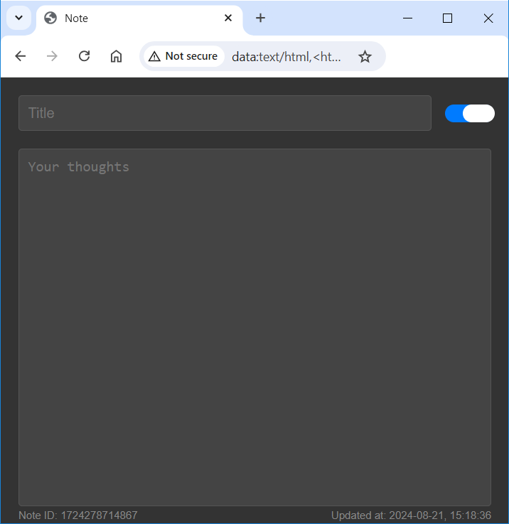

# ScribblePad

### Description:

**ScribblePad** is a minimalist, in-browser note-taking app designed for quick and private note capture. Focus on your ideas without distractions. Enjoy the freedom of a standalone, self-contained note that remains entirely yours.

### How to Use ScribblePad:

**ScribblePad** is designed for effortless use. Follow these simple steps to get started:

1. **Obtain the Code:** Copy the entire contents of the `src/app.min.html` file.
1. **Create a Bookmarklet:**
    - Access your browser's bookmark manager.
    - Create a new bookmark.
    - Give it a name like "ScribblePad".
    - Paste the copied code into the URL field.
1. **Start Taking Notes:** Click on the newly created bookmarklet to open a new tab with your ScribblePad.

That's it! You're ready to start jotting down your thoughts and ideas.

### Features:

- **Ultimate Privacy:** Your notes are stored solely within your browser, ensuring complete control over your data. No external servers or third-party involvement.
- **Instant Accessibility:** Access your notes from any device with a web browser using a simple bookmarklet.
- **Isolated Notes:** Each note exists independently in its own browser tab, preventing accidental mixing or loss of content.
- **Rapid Auto-Save:** Your notes are automatically saved every 5 seconds, guaranteeing data preservation even in unexpected browser closures.
- **Reliable Restoration:** Notes are reliably restored upon page reload or after browser crashes, thanks to robust data recovery mechanisms.
- **Customization:** Choose between light and dark themes to match your preference or environment.
- **Browser Compatibility:** Currently optimized for Chrome and Firefox.

### Limitations:

- **Standalone Notes:** Notes are isolated to individual browser sessions and cannot be synced across devices.
- **Basic Formatting:** ScribblePad focuses on plain text simplicity, offering no advanced formatting options.
- **No Version History:** While browser history can be used to track changes (by searching for your note ID), ScribblePad does not provide built-in version control.

### Troubleshooting:

If you encounter any issues with ScribblePad, try the following steps:

1. **Clear Browser Cache and Data:** Sometimes, browser cache or data can interfere with web applications. Clearing your browser's cache and data might resolve the problem.
1. **Check Browser Compatibility:** ScribblePad is primarily designed for Chrome and Firefox. Ensure you're using a supported browser.
1. **Verify Code Integrity:** Double-check that you have copied the entire contents correctly.
1. **Use the lite version of the app:** Employing the `src/app.version.lite.min.html` file instead of `src/app.min.html` may be advantageous if your browser faces limitations with long URLs (approximately 2,000 characters). This smaller file size can mitigate potential issues arising from URL length restrictions.

### Screenshots:

Light and Dark themes of the application:

  
Screenshots from mobile device (click to preview)

   

  
Screenshots from desktop browser (click to preview)

   

